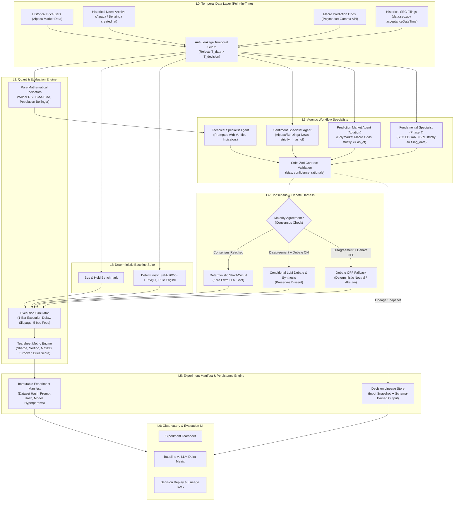
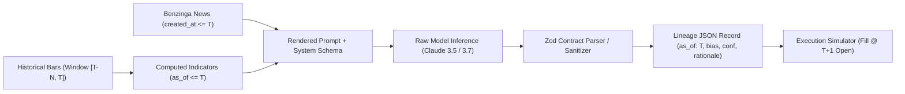
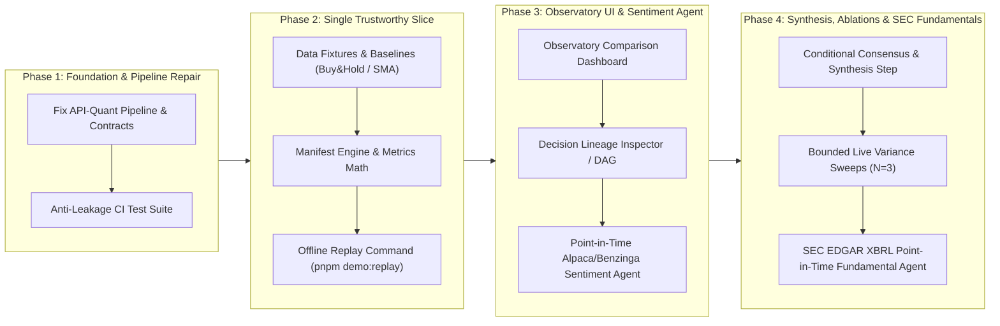

# PRD — QuantAgent: Agent Decision Evaluation Lab

**Document Version:** 2.1.0 (Evaluation Lab Specification)  
**Date:** August 14, 2026  
**Status:** Approved for Implementation  
**Canonical Project Name:** **QuantAgent** *(formerly referred to under the working code-name "The Committee")*  
**Supersedes:** `PRD.md` (Version 1.0.0 — Paper-Trading System)

---

## 1. Executive Summary & Problem Statement

### 1.1 Problem Statement
The open-source landscape is saturated with "multi-agent AI hedge funds" and "autonomous trading bots" that promise automated market alpha. In practice, these systems suffer from critical scientific and engineering flaws:
1. **Uncontrolled Look-Ahead Bias:** Market data, corporate fundamentals, and news are queried without strict temporal point-in-time (`as_of`) isolation, rendering backtest curves fictional.
2. **Missing Deterministic Baselines:** Systems fail to benchmark agentic LLM workflows against simple, cost-free deterministic rules (e.g., standard SMA/RSI crossovers or Buy & Hold).
3. **Black-Box Justification:** Multi-agent architectures (specialists, debate rounds, episodic memory) are introduced without measuring whether the added token cost, latency, and failure surface produce an empirically measured improvement.
4. **Lack of Decision Replay:** Experiments cannot be audited or replayed because the exact input lineage (dataset snapshot, prompt hash, indicator state, model version) is never persisted immutably.

### 1.2 Solution
**QuantAgent** is a reproducible benchmarking and observability platform designed to test whether structured LLM workflows improve financial decision-making over deterministic baselines under strict point-in-time constraints.

Finance serves as the rigorous benchmark domain because temporal correctness is non-negotiable. The platform features an end-to-end evaluation pipeline that executes deterministic baselines side-by-side with structured agent workflows, persisting full input/output lineage, calculating financial and LLM operational metrics, and enforcing automated anti-leakage test suites.

---

## 2. Product Identity & Target Audience

### 2.1 One-Line Pitch
> An open-source, reproducible evaluation lab that measures whether structured LLM workflows earn their cost and complexity over deterministic financial baselines without leaking future information.

### 2.2 Core Thesis
**Agentic complexity must be justified by reproducible, measured improvement.** A negative result (e.g., *"Debate increased token cost by 3.2x but did not yield an observed risk-adjusted delta over a 20-day SMA baseline"*) is considered a first-class, scientifically valuable finding.

### 2.3 Target Personas
- **AI & Quant Researchers:** Evaluating multi-agent decision dynamics, confidence calibration, and prompt strategies under zero-leakage constraints.
- **Applied AI Engineers & Reviewers:** Auditing production-grade agent patterns (Zod schema validation, failure isolation, deterministic fallbacks, token/cost telemetry).
- **Hiring Managers & Technical Evaluators:** Inspecting disciplined systems engineering, test-driven data pipelines, and scientific evaluation methodologies.

---

## 3. Operating Modes & Live Token Budgeting

| Dimension | Mode A: Offline Replay Mode (Default) | Mode B: Live Experiment Mode |
| :--- | :--- | :--- |
| **Purpose** | Deterministic demo, local development, CI/CD verification | Active research, prompt tuning, empirical variance sweeps |
| **Credentials Required** | **Zero** (no Anthropic, Alpaca, or Postgres keys needed) | Anthropic API key, optional Alpaca market/news API key |
| **Market Data** | Frozen, provenance-tagged historical JSON/Parquet fixtures | Seeded historical window or live-fetched market bars |
| **LLM Execution** | Recorded, schema-validated model outputs | Fresh multi-run LLM calls with variance measurement |
| **Execution Scope** | Full historical backtest (1+ years, ~252 decision points) | **Budget-Capped:** Focused validation window (20–30 decision points) |
| **Execution Time / Cost** | Sub-second local execution / **$0.00 Cost** | ~10–30 seconds / **Bounded (< $5.00 per sweep)** |

---

## 4. System Architecture & Layers

---

## 5. Functional Requirements & Feature Breakdown

### 5.1 Temporal Data Layer & Hybrid Data Acquisition (L0)
- **FR-01 (Point-in-Time Enforcement):** Every market bar, corporate datum, news headline, and computed indicator snapshot must be queryable strictly via `as_of <= decision_timestamp`.
- **FR-02 (Anti-Leakage Guard):** Ingestion and query layers must reject any record where publication/availability time is after the decision timestamp.
- **FR-03 (Hybrid Data Architecture — Download Once, Replay Offline):**
  - **The Seeding CLI (`pnpm seed:data`):** A lightweight ingestion script that calls free public endpoints to fetch historical data for a given ticker and year, then immutably freezes it into local JSON/Parquet files (`packages/fixtures/`):
    - **Price Bars:** Alpaca Market Data / Yahoo Finance daily/hourly OHLCV bars.
    - **Sentiment News:** Alpaca News API (Benzinga historical archive back to 2015) using article `created_at` timestamps.
    - **Macro Prediction Odds (Optional Ablation):** Polymarket Gamma API (CLOB historical pricing on Fed rates, inflation, and macro events).
    - **Fundamentals (Phase 4):** SEC EDGAR `data.sec.gov` XBRL Company Facts using official filing timestamps (`acceptanceDateTime` / `filed`).
- **FR-04 (Pre-Bundled Offline Fixtures):** Provide pre-packaged, zero-credential historical datasets (AAPL, NVDA, SPY for 2023–2024) directly in the repository so new users can execute the full benchmark offline in under 1 second at $0.00 cost.

### 5.2 Quant & Deterministic Baselines (L1 & L2)
- **FR-05 (Pinned Indicators):** Pure mathematical computation of Technical Indicators (SMA, EMA, Wilder RSI, Bollinger Bands, MACD) in code (Python/FastAPI or TypeScript), never generated by LLM reasoning.
- **FR-06 (Deterministic Baselines):**
  - *Baseline A:* Buy and Hold benchmark.
  - *Baseline B:* Standard SMA(20/50) + RSI(14) rule-based strategy.
- **FR-07 (Realistic Backtest Execution):**
  - Next-bar open execution (signals generated at decision point $T$ execute at $T+1$ bar open).
  - Explicit transaction cost modeling (default: 5 bps / 0.05% per trade) and slippage estimates.

### 5.3 Agent Workflow, Consensus & Debate Harness (L3 & L4)
- **FR-08 (Specialist Agents):**
  - *Technical Agent (Core MVP):* Evaluates verified indicator snapshots.
  - *Sentiment Agent (Core MVP):* Evaluates timestamped Benzinga news headlines $\le \text{decision\_timestamp}$.
  - *Prediction Market Agent (Optional Macro Ablation):* Evaluates Polymarket crowdsourced probability curves on macroeconomic events (e.g., FOMC rate hikes).
  - *Fundamental Agent (Phase 4 Extension):* Evaluates point-in-time SEC EDGAR financial statements.
  - Output Schema: Zod-validated `bias` (`bullish` | `bearish` | `neutral`), `confidence` (0.0–1.0), and `rationale`.
- **FR-09 (Failure Isolation):** Agent timeouts or malformed LLM outputs automatically degrade to a neutral signal (`bias: neutral, confidence: 0.0`) without halting the evaluation run.
- **FR-10 (Deterministic Consensus Short-Circuit):** When specialists agree in directional bias, skip synthesis calls to conserve token cost and latency.
- **FR-11 (Conditional Debate vs. Ablation Counterfactual):**
  - **Debate ON (Experimental Arm):** When specialists disagree, trigger a single-pass LLM debate/synthesis step to reconcile conflicting arguments and record the dissenting view.
  - **Debate OFF (Ablation Control):** When specialists disagree and debate is disabled, the system executes a deterministic fallback rule: **Default to Neutral (`bias: neutral, confidence: 0.0` / Abstain / No-Trade)**. This ensures clean, measurable counterfactual evaluation.
  - **Polymarket ON vs. OFF Ablation:** Test whether adding crowdsourced macro odds improves decision quality and reduces drawdown compared to news sentiment alone.

### 5.4 Experiment Manifest & Evaluation Protocol (L5)
- **FR-12 (Immutable Experiment Manifest):** Every evaluation run produces an immutable JSON manifest storing:
  - Experiment metadata: `id`, `created_at`, `git_commit`, `dataset_hash`, `timeframe`.
  - Strategy configuration: Model ID, temperature, prompt template hash, baseline parameters.
  - Metric summary: Returns, risk metrics, cost/latency breakdown.
- **FR-13 (Decision Replay DAG):** Given any timestamp in an experiment, reconstruct the exact input bar window, computed indicator state, prompt text, raw LLM completion, parsed schema, and final signal.

- **FR-14 (Live-Mode Bounded Variance Sweeps):** Live evaluation mode runs nondeterministic LLM workflows across $N$ iterations (default $N=3$) over a **budget-capped validation window (20–30 decision points)**, reporting mean, standard deviation, and observed deltas.

### 5.5 Observatory & Tearsheet UI (L6)
- **FR-15 (Experiment Comparison Dashboard):** Side-by-side comparison table between Deterministic Baselines and LLM Workflow variants.
- **FR-16 (Comparative Equity Curve):** Time-series charting of strategy equity curves against Baselines.
- **FR-17 (Decision Inspector):** Interactive audit view for inspecting any discrete decision point's input facts, prompt, debate transcript, and downstream execution.
- **FR-18 (Telemetry Breakdown):** Visual reporting of Total Token Expenditure, API Cost ($ USD), Latency per Decision (ms), and Malformed/Fallback Rate.

---

## 6. Evaluation Protocol & Metric Suite

The platform evaluates strategies across three pillars: **Financial Quality**, **Decision Intelligence**, and **System Efficiency**.

### 6.1 Evaluation Metric Definitions

| Category | Metric | Definition & Purpose |
| :--- | :--- | :--- |
| **Financial Performance** | **Total & Annualized Return** | Cumulative strategy growth vs. Buy & Hold benchmark. |
| | **Sharpe Ratio** | Excess return per unit of total risk (risk-free rate = 0% or configured). |
| | **Sortino Ratio** | Excess return per unit of downside semi-deviation. |
| | **Max Drawdown (MDD)** | Peak-to-trough decline over the evaluation window. |
| | **Turnover & Trade Count** | Frequency of position changes and impact of transaction fees. |
| **Decision Intelligence** | **Directional Accuracy** | % of directional signals matching next-period price movement direction. |
| | **Brier Score / Calibration** | Mean squared error between confidence (0–1) and realized binary outcome. *(Note: Neutral/abstain decisions are excluded from Brier calculation).* |
| | **Abstention Quality** | Realized market return during neutral/abstain periods vs. active exposure periods. |
| **Operational Efficiency** | **Cost per 100 Decisions** | Cumulative Anthropic API cost ($ USD) for agent inferences. |
| | **Median Decision Latency** | Time in milliseconds from data timestamp to finalized decision. |
| | **Degradation / Error Rate** | % of agent calls that timed out or required schema repair fallbacks. |

---

## 7. Non-Functional Requirements & Test Specifications

### 7.1 Automated Anti-Leakage Test Suite (P0 Gate)
- **NFR-01 (Future Data Rejection):** A dedicated unit test must deliberately inject data timestamped $T+1$ into a query for timestamp $T$ and assert that the query engine throws a `TemporalIntegrityViolation` error.

### 7.2 Performance & Determinism
- **NFR-02 (Offline Execution Time):** The full offline demo/replay suite over a 1-year daily bar window must execute in under 3.0 seconds.
- **NFR-03 (Zero Mock Leakage in UI):** The dashboard must consume actual API/manifest JSON responses; no hardcoded static UI mocks in production components.

### 7.3 Security & Secrets
- **NFR-04 (Credential Hygiene):** Zero requirement for credentials during local build, linting, and testing. All API keys remain isolated in environment variables.

---

## 8. MVP Scope vs. Explicitly Deferred Features

### 8.1 In-Scope for Core MVP
1. **Vertical Slice:** Historical bar fixture $\to$ Indicator computation $\to$ Technical + Sentiment Strategy $\to$ Deterministic Baseline (Buy&Hold + SMA/RSI) $\to$ Experiment Manifest $\to$ Comparison Dashboard.
2. **Backtest Engine:** Correct 1-bar execution delay, transaction costs (5 bps), Sharpe/Sortino/MaxDD calculation.
3. **Input Lineage Persistence:** Full provenance capture for every decision in an experiment.
4. **Anti-Leakage Build-Failing Test:** Automated CI test verifying future-data rejection.
5. **One-Command Offline Replay:** `pnpm demo:replay` script loading pre-computed evaluation runs without external network dependencies.

### 8.2 Explicitly Deferred (Out of Scope for MVP)
- **Live/Paper Brokerage Execution:** Live Alpaca order execution, WebSocket order tracking, OAuth flow.
- **Telegram Bot / Push Alerts:** Chatbot commands (`/portfolio`, alerts).
- **Episodic Vector Memory:** Long-term vector DB embedding stores for trade reflections.
- **Prediction Market Cloning:** PMXT adapters or betting contract execution.
- **Multi-Round Unbounded Debate:** Extended iterative agent debates beyond 1 synthesis pass.
- **Live Profitability Marketing Claims:** Marketing the tool as an investment strategy.

---

## 9. Implementation Roadmap & Milestones

### Phase 1: Foundation & Pipeline Repair
- Connect `apps/api` to `apps/quant` or internal indicator computation (resolve `bars: []` / `indicators: null`).
- Unify `@committee/contracts` across frontend and backend (resolve `/agents/latest` envelope parsing).
- Add the `TemporalIntegrityViolation` test to CI.

### Phase 2: Single Trustworthy Experiment Slice
- Integrate standard baseline strategies (Buy & Hold, SMA/RSI).
- Implement backtest transaction costs, slippage, Sharpe, Sortino, and Drawdown math.
- Persist immutable experiment manifests to database/file storage.
- Deliver `pnpm demo:replay`.

### Phase 3: Observatory UI & Point-in-Time Sentiment Agent
- Build Experiment Tearsheet comparing Baselines vs. Specialist Agents.
- Build Decision Lineage Inspector showing bar/indicator inputs and agent rationale for any timestamp.
- Integrate Alpaca News API (Benzinga) point-in-time feed for Sentiment Specialist.

### Phase 4: Multi-Agent Synthesis, Ablations & SEC Fundamentals
- Implement the consensus check with conditional single-pass LLM debate synthesis vs. deterministic neutral fallback ablation.
- Execute bounded live variance sweeps ($N=3$, 20–30 decision points).
- Implement the Polymarket macro probability specialist ablation (testing macro prediction odds vs. news sentiment alone).
- Add the SEC EDGAR XBRL point-in-time Fundamental Specialist as an advanced extension.

---

## 10. Success & Acceptance Criteria

1. **Zero-Credential Replayability:** A new developer can clone the repository, run `pnpm install && pnpm demo:replay`, and explore a complete backtested experiment on the web dashboard in under 60 seconds without API keys.
2. **Deterministic Baseline Verification:** Every LLM agent strategy run is presented alongside identical-condition Buy & Hold and SMA/RSI baseline tearsheets.
3. **Provable Input Lineage:** Selecting any historical trade in the dashboard displays the exact historical input bars, indicators, news, prompt, raw LLM completion, and schema validation result.
4. **Verifiable Anti-Leakage:** CI build fails immediately if any data point timestamped $> T$ is accessed during decision cycle $T$.
5. **Clean Ablation Measurement:** The system directly computes and displays the delta in Sharpe, Drawdown, Latency, and API Cost between:
   - Deterministic Baselines
   - Single Specialist (Technical)
   - Multi-Specialist with Consensus Short-Circuit
   - Multi-Specialist with Conditional Debate Synthesis
   - Multi-Specialist without Debate (Neutral Fallback Ablation)
