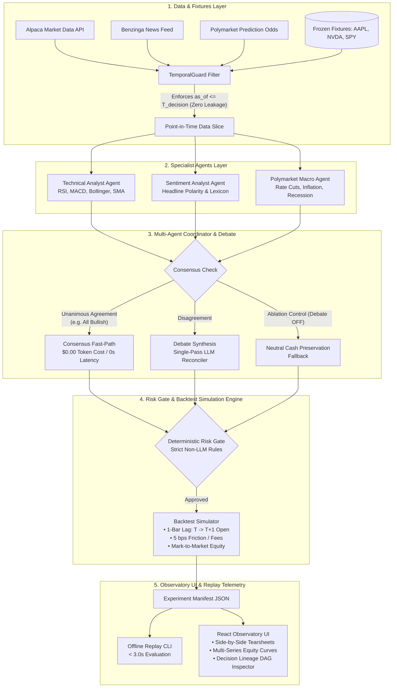
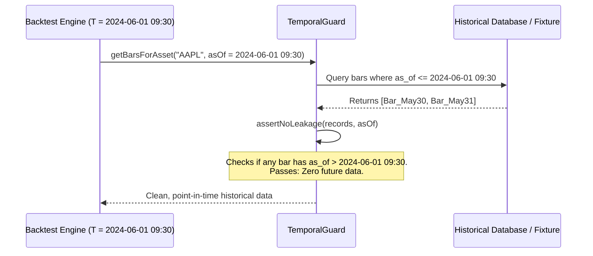
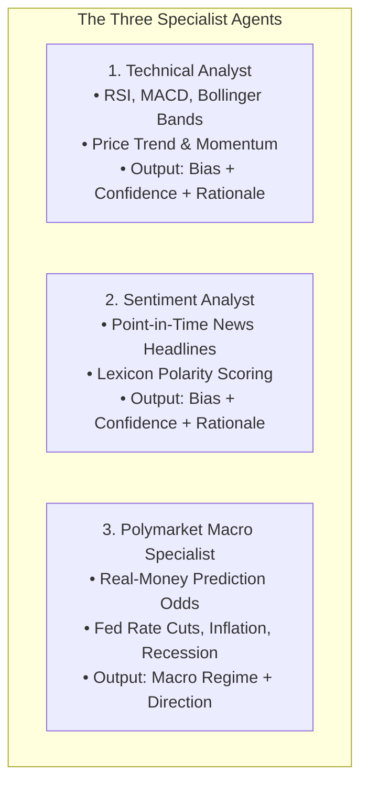
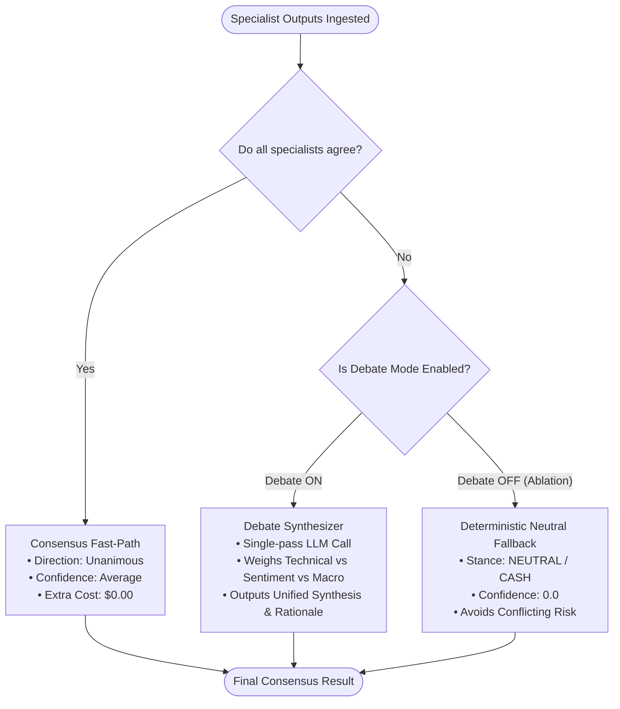

# QuantAgent: Agent Decision Evaluation Lab
## Comprehensive Course Project Architecture, Specification & Feature Guide

---

## 1. Executive Summary & Real-World Use Case (In Simple Language)

### What is QuantAgent?
**QuantAgent** is an empirical **Agent Decision Evaluation Lab** for quantitative financial decision-making. 

In simple terms: instead of trusting a single AI model (like ChatGPT or Claude) to blindly give financial advice or trade stocks, QuantAgent sets up a structured **"Committee of AI Specialists"** (a Technical Chart Analyst, a News Sentiment Specialist, and a Macro Prediction Market Analyst) that independently evaluate market conditions and debate their findings before making a decision. 

More importantly, QuantAgent is **not** a speculative "get-rich-quick trading bot". It is a **scientific benchmarking laboratory** that answers a critical research question in modern Artificial Intelligence:
> *"Does adding complex multi-agent LLM debates, sentiment analysis, and prediction market data actually produce superior risk-adjusted investment returns compared to simple, zero-cost deterministic trading rules (like a 20/50 Simple Moving Average crossover or Buy & Hold) once you account for execution delays, transaction fees, and AI token costs?"*

```
                ┌─────────────────────────────────────────────────────────┐
                │             The Core Research Question                  │
                │                                                         │
                │   Multi-Agent LLM Committee    VS    Deterministic Math │
                │   (Technical + Sentiment +           (SMA / RSI Rules / │
                │    Polymarket + Debate)               Buy & Hold)       │
                │                                                         │
                │        Evaluated under Strict Zero-Leakage Rules        │
                │        + 1-Bar Execution Lag + 5 bps Trading Fees       │
                └─────────────────────────────────────────────────────────┘
```

---

### The Fundamental Problems Solved by QuantAgent

Most existing open-source "AI trading agent" projects suffer from four critical methodological flaws:

1. **Look-Ahead Bias & Future Data Leakage:**
   Typical AI scripts accidentally give the model future information (e.g., querying price data or news published *after* the decision timestamp $T$). This produces artificially inflated, fictional backtest profits.
   *QuantAgent's Solution:* A strict **Point-in-Time (PIT) TemporalGuard** enforces that every price bar, news headline, and indicator was mathematically knowable strictly at or before decision time $T$ ($as\_of \le T$). Any violation immediately throws an exception.

2. **Missing Deterministic Baselines:**
   Many AI projects celebrate a +15% return without comparing it to a basic zero-cost benchmark (e.g., what if the S&P 500 rose +24% in that same period, or a simple 20-day SMA rule made +18% for $0.00 in LLM API fees?).
   *QuantAgent's Solution:* Every agent strategy is evaluated side-by-side on the exact same price series against **Buy & Hold** and a **Deterministic SMA(20/50) + RSI(14)** strategy.

3. **Hallucinated Financial Calculations:**
   Large Language Models are notorious for making arithmetic mistakes when calculating moving averages, percentages, or portfolio returns.
   *QuantAgent's Solution:* **The "Facts vs. Narration" Invariant**. LLMs *never* compute math in QuantAgent. Pure TypeScript and Python engines calculate all indicators, returns, and drawdowns deterministically. The LLM only receives verified facts and provides qualitative structured reasoning.

4. **Lack of Provable Lineage and Replayability:**
   When an AI bot makes a bad trade, developers usually cannot reproduce why it happened.
   *QuantAgent's Solution:* Full **Decision Lineage Telemetry**. Every decision stores an immutable audit trail containing the exact historical data slice, the rendered prompt, the raw LLM completion, the Zod schema validation, the debate transcript, and the simulated order execution.

---

## 2. Project Evolution, Roles & Development Plan

### The Evolution: From "The Committee" to "Evaluation Lab"
* **Phase 1 (Original Plan — "The Committee"):** A paper-trading reference architecture with Technical, Sentiment, and Fundamental agents, a debate coordinator, and Alpaca paper API execution.
* **Phase 2 (Scientific Evolution — "QuantAgent Evaluation Lab"):** Refactored to focus on rigorous evaluation, ablation testing (e.g., testing Debate ON vs. Debate OFF control), prediction market integration (Polymarket), and zero-cost deterministic offline replay fixtures.

---

### Team Roles & Separation of Concerns (M1–M4)

The project was structured across 4 distinct domains to ensure clean architecture and parallel execution:

```
┌───────────────────────────────────────────────────────────────────────────────┐
│                          QuantAgent Domain Matrix                             │
├─────────────────┬─────────────────┬────────────────────┬──────────────────────┤
│  M1: Lead /     │  M2: Quant &    │  M3: Frontend /    │  M4: Platform &      │
│  Architecture   │  Data Lead      │  UI Lead           │  Risk Lead           │
├─────────────────┼─────────────────┼────────────────────┼──────────────────────┤
│ • Agent Runner  │ • Market Data   │ • Web Dashboard    │ • PostgreSQL DB      │
│ • BaseAgent     │ • Indicators    │ • Multi-Series     │ • User Auth/Sessions │
│ • Debate Logic  │ • Backtest Math │   Equity Curves    │ • AES-256 Vault      │
│ • Zod Contracts │ • Fixtures      │ • Lineage DAG UI   │ • Hard Risk Gate     │
└─────────────────┴─────────────────┴────────────────────┴──────────────────────┘
```

1. **M1 (Agent Architecture Lead):** Built `@committee/contracts`, the `BaseAgent` abstraction, parallel execution runner, graceful error degradation (`NO_OPINION`), Technical & Sentiment specialists, and multi-agent debate synthesis.
2. **M2 (Quant & Data Lead):** Built the data ingestion pipelines, indicator engine (SMA, EMA, Wilder RSI, Bollinger Bands, MACD), backtesting simulation engine (Sharpe, Sortino, Max Drawdown, transaction fees), and frozen historical datasets.
3. **M3 (Frontend & UI Lead):** Built the web application (`apps/web`) featuring the Evaluation Observatory, side-by-side strategy comparison tearsheets, Recharts equity curves with drawdown bands, and the Decision Lineage DAG Inspector drawer.
4. **M4 (Platform & Risk Lead):** Built the PostgreSQL database schema with Drizzle ORM, user registration/session authentication, AES-256-GCM encrypted API credential vault, and the deterministic risk manager.

---

### Specifications & Evaluation Lab Issue Tickets

The development was guided by formal specification documents and numbered issues:

| Spec / Issue | Module | Title & Core Responsibility |
| :--- | :--- | :--- |
| **Spec 01** | `packages/db` | Database schema for bars, indicators, agent runs, and outputs with `as_of` fields. |
| **Spec 02** | `packages/contracts` | Shared Zod schemas & TypeScript types (the single source of truth). |
| **Spec 03** | `apps/api` | User authentication, bcrypt password hashing, and AES-256-GCM credential vault. |
| **Spec 04** | `apps/api` | Alpaca market data ingestion with idempotent upserts and session-close timestamps. |
| **Spec 05** | `apps/quant` | Deterministic Python indicator engine (RSI, MACD, Bollinger, SMA). |
| **Spec 06** | `apps/api` | Agent framework, timeout handling, and deterministic FNV-1a seeded stubs. |
| **Spec 07** | `apps/api` | Technical Analyst agent with deterministic rule classifier and LLM narration. |
| **Spec 08** | `apps/web` | React dashboard shell, KPI summary cards, and portfolio overview. |
| **Lab Issue 01** | `packages/fixtures` | `TemporalGuard` anti-leakage interceptor and zero-cost frozen fixtures (AAPL, NVDA, SPY). |
| **Lab Issue 02** | `apps/api` | Pure TypeScript deterministic indicator engine and Buy & Hold / SMA-RSI baseline engines. |
| **Lab Issue 03** | `apps/api` | `runExperiment` orchestrator, immutable `ExperimentManifest`, and `pnpm demo:replay` CLI. |
| **Lab Issue 04** | `apps/api` | News sentiment specialist with point-in-time keyword polarity and LLM synthesis. |
| **Lab Issue 05** | `apps/api` | Consensus short-circuit, conditional debate synthesis, and Debate OFF ablation controls. |
| **Lab Issue 06** | `apps/web` | Observatory comparison tearsheet, Recharts multi-series equity curves, and drawdown bands. |
| **Lab Issue 07** | `apps/web` | Interactive Decision Lineage DAG Inspector (data slice, prompts, completions, trade fills). |
| **Lab Issue 08** | `apps/api` | Macro Prediction Market Specialist (Polymarket Gamma odds) and live variance sweeps. |

---

## 3. High-Level System Architecture



---

## 4. Feature-by-Feature Deep Dive

---

### Feature 1: Point-in-Time Data Ingestion & TemporalGuard

* **Problem:** In financial backtesting, if an algorithm makes a decision on `2024-03-01 10:00 AM` using daily data that includes the `2024-03-01 4:00 PM` close price, it has seen 6 hours into the future. This is the #1 cause of fake backtest results.
* **How QuantAgent Solves It:**
  1. Every database record and fixture object contains an immutable `as_of` timestamp.
  2. Daily bars are stamped with session close (`16:00 ET`). Hourly bars with `open_ts + 1h`.
  3. The `TemporalGuard` acts as an interceptor: any query at decision timestamp $T_{decision}$ filters records where $as\_of \le T_{decision}$.
  4. If any data record with $as\_of > T_{decision}$ is detected in the input pipeline, `assertNoLeakage()` throws a `TemporalIntegrityViolation` and halts execution.



---

### Feature 2: Deterministic Technical Indicator Engine

* **Problem:** Large language models cannot reliably calculate complex statistical formulas like 14-period Wilder RSI or 2-standard-deviation Bollinger Bands.
* **How QuantAgent Solves It:**
  1. Implemented in pure TypeScript (`apps/api/src/indicators/`) and Python (`apps/quant/`).
  2. Computes:
     - **SMA-20 & SMA-50:** Simple Moving Averages for trend detection.
     - **Wilder RSI (14):** Relative Strength Index measuring overbought ($>70$) and oversold ($<30$) momentum.
     - **Bollinger Bands (20, 2):** Volatility envelopes measuring price displacement ($z$-score).
     - **MACD (12, 26, 9):** Moving Average Convergence Divergence trend oscillator.
  3. **The Facts vs. Narration Invariant:** The indicator engine calculates exact numbers. When the Technical Agent runs, these calculated numbers are injected directly into the agent’s output object, preventing any LLM hallucination from corrupting the indicators.

```
                    ┌──────────────────────────────────────┐
                    │ Raw Price Bars (as_of <= T_decision) │
                    └──────────────────┬───────────────────┘
                                       │
            ┌──────────────────────────┼──────────────────────────┐
            ▼                          ▼                          ▼
   ┌─────────────────┐        ┌─────────────────┐        ┌─────────────────┐
   │ Wilder RSI (14) │        │  Bollinger (20) │        │  MACD (12,26,9) │
   │ Oversold: < 30  │        │ Upper = μ + 2σ  │        │ Fast EMA - Slow │
   │ Overbought: > 70│        │ Lower = μ - 2σ  │        │ Signal EMA (9)  │
   └────────┬────────┘        └────────┬────────┘        └────────┬────────┘
            └──────────────────────────┼──────────────────────────┘
                                       ▼
                       ┌───────────────────────────────┐
                       │  IndicatorSnapshot Object     │
                       │  (Immutable Ground Truth)     │
                       └───────────────────────────────┘
```

---

### Feature 3: Multi-Agent Specialist Committee

QuantAgent employs three distinct specialist agents, each evaluating a different market dimension:



1. **Technical Analyst Agent:**
   - Evaluates price action and the indicator snapshot.
   - Runs a mechanical rule-based classifier first to compute a baseline score ($[-1.0, +1.0]$).
   - In live mode, uses Claude 3.5 / Haiku with structured JSON Schema tool-calling to generate an analytical rationale.
   - Blends mechanical conviction and model conviction ($50/50$).

2. **Sentiment Analyst Agent:**
   - Analyzes recent news headlines strictly published prior to $T_{decision}$.
   - Scans against financial sentiment dictionaries (bullish/bearish keywords) to establish baseline polarity.
   - Summarizes overall news tone and potential market catalysts.

3. **Polymarket Macro Specialist Agent:**
   - Ingests probability curves from decentralized prediction markets (Polymarket).
   - Tracks macro event contracts: Federal Reserve rate cut probabilities, CPI inflation spikes, and recession odds.
   - Identifies macroeconomic regimes (e.g., *Dovish Easing*, *Hawkish Tightening*, *Stagflation Risk*).

---

### Feature 4: Consensus Coordinator & Debate Synthesis

* **Problem:** If agents disagree (e.g., Technical is Bullish, but Sentiment is Bearish due to negative earnings news), how should the system decide?
* **How QuantAgent Solves It:**
  1. **Consensus Fast-Path:** If all active specialists agree on direction (e.g., all Bullish), the coordinator immediately confirms the decision. Confidence is averaged. **Cost: 0 extra LLM tokens ($0.00), 0ms LLM latency**.
  2. **Disagreement & Debate ON:** If specialists disagree, a **Debate Synthesizer** runs a single-pass reconciliation LLM prompt containing each specialist’s arguments and evidence, weighing conflicting factors to produce a synthesized verdict.
  3. **Disagreement & Debate OFF (Ablation Control):** In the ablation test group, whenever specialists disagree, the system deterministically falls back to neutral cash preservation (`bias = neutral, confidence = 0.0`). This lets researchers prove whether LLM debate actually produces excess returns compared to just stepping aside when signals conflict.



---

### Feature 5: Deterministic Risk Gate & Backtest Simulation Engine

* **Problem:** In real trading, models cannot trade infinitely or execute at the same moment an indicator fires.
* **How QuantAgent Solves It:**
  1. **Deterministic Risk Gate:** A non-LLM rules engine that cannot be "talked into" a trade. It enforces max position sizes, prevents trading during high-spread conditions, and blocks trades if agent confidence is below a defined threshold (e.g., $<0.40$).
  2. **1-Bar Execution Lag ($T \rightarrow T+1$ Open):** If a signal is generated at the close of Day $T$ ($4:00\text{ PM}$), the trade is executed at the **Open price of Day $T+1$ ($9:30\text{ AM}$)**.
  3. **Frictional Costs & Slippage:** Deducts a 5 basis points ($0.05\%$) transaction fee on every trade to simulate real brokerage costs.
  4. **Financial Performance Metrics Computed:**
     $$\text{Sharpe Ratio} = \frac{\mathbb{E}[R_p - R_f]}{\sigma_p} \times \sqrt{252}$$
     $$\text{Sortino Ratio} = \frac{\mathbb{E}[R_p - R_f]}{\sigma_{\text{downside}}} \times \sqrt{252}$$
     $$\text{Max Drawdown} = \max_{t} \left( \frac{\text{Peak}_t - \text{Equity}_t}{\text{Peak}_t} \right)$$
  5. **Decision Intelligence Metrics:**
     - **Directional Accuracy (Hit Rate):** Percentage of active trades that moved profitably in the predicted direction.
     - **Brier Score:** Mean squared error between the agent's probabilistic confidence and binary market outcomes (measuring overconfidence vs. calibration).
     - **Abstention Quality:** Evaluates whether periods where the agent chose `NEUTRAL` successfully avoided market drawdowns.

---

### Feature 6: React Web Observatory & Decision Lineage DAG Inspector

The frontend (`apps/web`) is a reactive, financial analytics dashboard designed for side-by-side evaluation:

```
┌────────────────────────────────────────────────────────────────────────────────────────┐
│  QUANTAGENT OBSERVATORY  |  Asset: AAPL (2023-2024)  |  Mode: Offline Deterministic    │
├────────────────────────────────────────────────────────────────────────────────────────┤
│  STRATEGY TEARSHEET (Side-by-Side Matrix)                                              │
│  Strategy              Total Return   Ann. Sharpe   Sortino   Max DD   Brier   Cost    │
│  ────────────────────────────────────────────────────────────────────────────────────  │
│  Buy & Hold (SPY/AAPL)   +28.4%          1.42        1.85     -14.2%    N/A    $0.00   │
│  SMA(20/50) + RSI(14)    +19.1%          1.18        1.51     -8.4%     N/A    $0.00   │
│  Multi-Agent Debate ON   +24.6%          1.65        2.21     -6.1%    0.19    $1.82   │
│  Multi-Agent Debate OFF  +16.3%          1.31        1.70     -5.2%    0.24    $0.00   │
├────────────────────────────────────────────────────────────────────────────────────────┤
│  SYNCHRONIZED MULTI-SERIES EQUITY CURVES (Interactive Recharts + Drawdown Bands)      │
│  $140k ┤                                                  /─── Debate ON (+24.6%)     │
│  $120k ┤                                     /───────────/                            │
│  $100k ┼────────────────────────────────────/───────────────── Benchmark (+28.4%)     │
│   $80k ┤ [Click any bar to open Decision Lineage DAG Inspector]                       │
└────────────────────────────────────────────────────────────────────────────────────────┘
```

#### The Decision Lineage DAG Inspector Drawer
Clicking any point on the equity chart opens a slide-over audit drawer with 4 detailed tabs:
1. **Inputs Tab:** Exact OHLCV bar history, indicator snapshot values, and point-in-time news headlines available at that exact second.
2. **Debate Tab:** Specialist votes (Technical vs. Sentiment vs. Polymarket), consensus check status, and full debate transcript.
3. **Prompts Tab:** The exact system prompt, user prompt, and raw model completion (with 1-click clipboard copy).
4. **Execution Tab:** Order fill status, execution price (Bar $T+1$ Open), share quantity, transaction fee deducted, and realized P&L.

---

### Feature 7: Zero-Cost Offline Replay CLI (`pnpm demo:replay`)

To enable testing and grading without API keys or token costs, QuantAgent includes an offline replay engine:
* Run command: `pnpm demo:replay`
* Evaluates 1 year of daily market decisions across all strategies in **$< 3.0$ seconds** (typically $\approx 20\text{ ms}$).
* Uses pre-packaged, verified frozen fixtures (`AAPL.json`, `NVDA.json`, `SPY.json`) with deterministic rule synthesis.
* Cost: **$0.00**.

---

## 5. End-to-End Execution Walkthrough (How Everything Fits Together)

Let's trace what happens when the backtest simulator processes a single market bar on `2024-03-15`:

```
Step 1: Point-in-Time Slice
   Backtest clock advances to T = 2024-03-15 16:00 ET.
   TemporalGuard isolates price bars <= 2024-03-15.

Step 2: Indicator Computation
   Pure TypeScript engine computes RSI=28.4 (oversold), MACD crossover, Bollinger lower-band touch.

Step 3: Specialist Agent Evaluation
   • Technical Agent: Bullish (oversold bounce signal, confidence 0.75).
   • Sentiment Agent: Bearish (negative product delay headline, confidence 0.60).
   • Polymarket Agent: Bullish (Fed Rate Cut probability surged to 72%).

Step 4: Consensus & Debate Coordination
   Consensus Check detects disagreement (2 Bullish vs. 1 Bearish).
   Coordinator activates Debate Synthesizer:
   "While short-term headline sentiment is negative, technical indicators show heavy oversold exhaustion at major support, aligned with a dovish macro liquidity regime."
   Verdict: BULLISH (Confidence 0.68).

Step 5: Risk Gate Verification
   Risk Manager verifies: Position size <= 10% of portfolio, Confidence (0.68) >= 0.40 threshold.
   Status: APPROVED.

Step 6: Lineage Recording
   Immutable DecisionLineageRecord persisted with inputs, prompts, completions, and consensus result.

Step 7: Trade Execution Simulation
   At T+1 Open (2024-03-18 09:30 AM):
   Buy order executed at Open Price ($172.50). 5 bps fee ($0.086/share) deducted from cash.
   Portfolio equity marked to market.
```

---

## 6. Technology Stack Summary

| Layer | Technologies Used | Rationale |
| :--- | :--- | :--- |
| **Monorepo & Build** | Turborepo, `pnpm` (v11), `uv` (Python 3.12) | Instant cache hits (~20ms), clean workspace boundaries, unified scripts. |
| **Backend Orchestrator** | Node.js 20+, Fastify v5, TypeScript (`tsx`), `@anthropic-ai/sdk` | High-throughput async agent orchestration, type-safe API endpoints. |
| **Quantitative Engine** | Python 3.12, FastAPI, NumPy, Pandas, Pydantic v2 | High-performance vectorized numerical indicator calculations. |
| **Persistence & Database** | PostgreSQL 16, Drizzle ORM, `pgvector`, `pgcrypto` | Relational integrity with vector embeddings and encrypted credential vault. |
| **Contracts & Validation** | Zod (TypeScript runtime validation) | Strict type contracts between DB, LLMs, and frontend. |
| **Frontend UI** | React 18, Vite 6, Tailwind CSS 3.4, Recharts, TanStack Query | Responsive financial observatory with interactive multi-series charts. |
| **Testing & CI** | Vitest, Pytest, Playwright E2E, Docker Compose | Automated temporal-leakage tests and end-to-end simulation suites. |

---

## 7. How to Present This to Your Teacher

When presenting this project to your professor, highlight these key academic talking points:

1. **Focus on Scientific Rigor over Hype:**
   Explain that the goal was not to make claims about beating Wall Street, but to create a **scientifically rigorous evaluation testbed** for multi-agent LLM systems with zero look-ahead bias.
2. **The "Facts vs. Narration" Pattern:**
   Emphasize that LLMs are never allowed to do math. The system uses deterministic code for numerical calculations and only uses LLMs for structured qualitative reasoning and debate.
3. **Point-in-Time TemporalGuard:**
   Demonstrate how the `TemporalGuard` mathematically guarantees that data from time $T+1$ never leaks into decisions at time $T$.
4. **The Value of Negative & Ablation Findings:**
   Explain that QuantAgent specifically measures whether multi-agent debate justifies its token cost and latency compared to simple deterministic rules (e.g., Debate ON vs. Debate OFF vs. SMA/RSI).
5. **Zero-Cost Offline Replay:**
   Demonstrate `pnpm demo:replay` in the terminal to show instant, offline backtesting at $0.00 cost without requiring external paid API keys.
